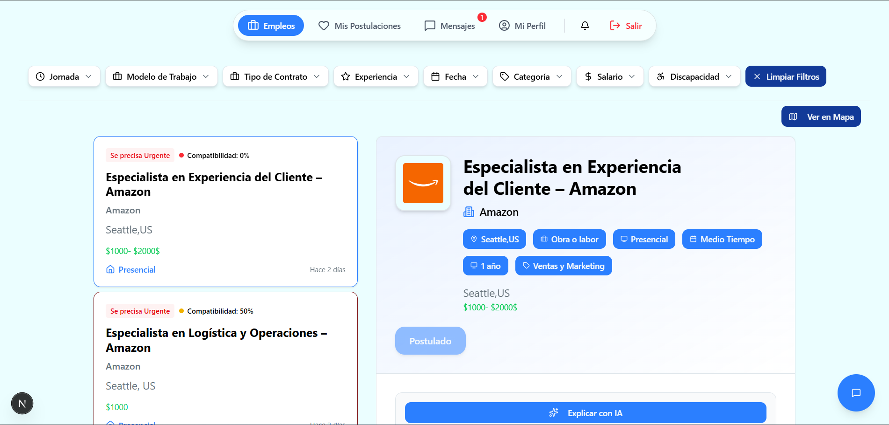

# Summa - Frontend

Summa Frontend es la interfaz de usuario del portal web de búsqueda de empleo inclusivo, construida para ofrecer una experiencia de usuario moderna, rápida y accesible. Aprovecha las capacidades de Next.js para un rendimiento óptimo y una excelente experiencia de desarrollo.

## ✨ Vista Previa del Proyecto



---

## 🚀 Tecnologías Principales

El frontend de Summa está construido con las siguientes tecnologías y librerías:

- **Framework:** Next.js (App Router)
- **Lenguaje:** TypeScript
- **Estilos:** TailwindCSS
- **Componentes UI:** shadcn/ui
- **Iconos:** Lucide-react
- **Cliente HTTP:** Axios
- **Gestión de Estado Remoto:** React Query (TanStack Query)
- **Formularios:** React Hook Form con Zod para validación
- **Autenticación:** NextAuth.js
- **Mapas:** React Leaflet
- **Gráficos:** Recharts
- **Gestión de Chat AI:** @ai-sdk/react

---

## 📂 Estructura del Proyecto

El proyecto sigue una estructura basada en características (feature-based) dentro del `App Router` de Next.js, lo que facilita la organización y escalabilidad.

```
/summa-frontend
├─ /public              # Archivos estáticos (imágenes, etc.)
├─ /src
│  ├─ /app              # Rutas y layouts de Next.js (App Router)
│  │  ├─ /(auth)        # Rutas relacionadas con autenticación
│  │  ├─ /(dashboard)   # Rutas principales de la aplicación
│  │  ├─ /(job-seeker)  # Rutas específicas para buscadores de empleo
│  │  ├─ /api           # Rutas de API (API Routes) de Next.js
│  │  ├─ /components    # Componentes globales y reutilizables
│  │  ├─ /hooks         # Custom React Hooks
│  │  ├─ /lib           # Utilidades y configuraciones (ej: axios, react-query)
│  │  ├─ /styles        # Archivos de estilos globales
│  │  └─ layout.tsx     # Layout principal de la aplicación
│  ├─ /components       # Componentes de UI compartidos (shadcn/ui, etc.)
│  ├─ /hooks            # Hooks personalizados para lógica reutilizable
│  ├─ /lib              # Configuraciones de librerías, utilidades, etc.
│  └─ /types            # Definiciones de tipos globales
├─ .env.local           # Variables de entorno locales
├─ next.config.ts       # Configuración de Next.js
├─ package.json         # Dependencias y scripts del proyecto
├─ postcss.config.mjs   # Configuración de PostCSS (para TailwindCSS)
├─ tailwind.config.mjs  # Configuración de TailwindCSS
├─ tsconfig.json        # Configuración de TypeScript
└─ ...
```

---

## 🛠️ Cómo Empezar (Getting Started)

Sigue estos pasos para configurar y ejecutar el proyecto en tu entorno de desarrollo local.

### Prerrequisitos

- [Node.js](https://nodejs.org/en/) (versión 18 o superior)
- [npm](https://www.npmjs.com/) o [Yarn](https://yarnpkg.com/)
- Un editor de código como [Visual Studio Code](https://code.visualstudio.com/)

### 1. Clonar el Repositorio

```bash
git clone https://github.com/Alvinferdeveloper/summa-frontend.git
cd summa-frontend
```

### 2. Configurar las Variables de Entorno

Crea un archivo `.env.local` en la raíz del directorio `summa-frontend`. Este archivo contendrá las variables de entorno necesarias para la aplicación.

```env
# Archivo: .env.local

# URL del backend de Summa
NEXT_PUBLIC_API_URL="http://localhost:8080/api"

# Credenciales de Google
GOOGLE_CLIENT_ID=
GOOGLE_CLIENT_SECRET=

# Credenciales de NextAuth
NEXTAUTH_SECRET=
NEXTAUTH_URL= "http://localhost:3000"

# Clave de Google AI Studio (para el agente de chat)
GOOGLE_GENERATIVE_AI_API_KEY=

# Otras variables de entorno necesarias...
```

### 3. Instalar Dependencias

```bash
npm install
# o
yarn install
```

### 4. Ejecutar la Aplicación en Modo Desarrollo

```bash
npm run dev
# o
yarn dev
```

La aplicación estará disponible en `http://localhost:3000`.

---

## ⚙️ Configuración

La configuración del frontend se gestiona a través de **variables de entorno** definidas en el archivo `.env.local`. Estas variables son accesibles en el código de Next.js y permiten adaptar la aplicación a diferentes entornos (desarrollo, producción).

---

## 🚀 Despliegue

Para construir la aplicación para producción, usa el siguiente comando:

```bash
npm run build
# o
yarn build
```

Esto generará una versión optimizada de la aplicación en la carpeta `.next/`.